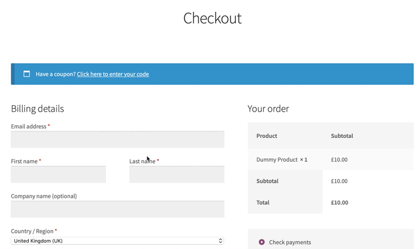

     

# WP Account & Login UX

WooCommerce can be configured to require an account to checkout, but does not check for an existing account until the customer clicks "Place order". This plugin moves the customer email field to the beginning of the checkout form and if an account exists matching the email address entered, a login form is displayed inline.

This is a work-in-progress. Some obvious improvements needed:

* Loading icon over the billing email as it is checked